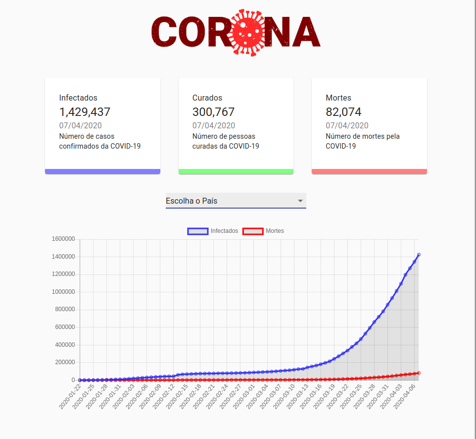
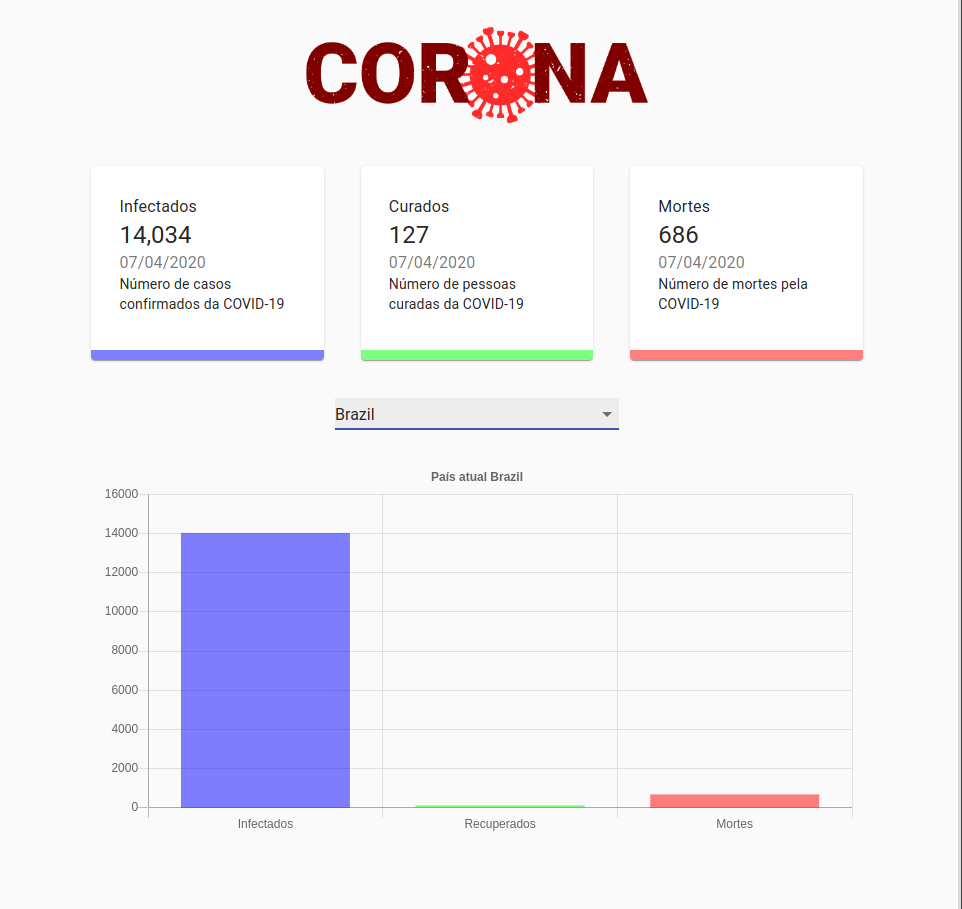

<h1 align="center">

</h1>
 

<h3 align="center"> Site de estatísticas do Corona-vírus, projeto responsivo usando React, Material UI, Chart.js</h3>
 

## Projeto desenvolvido com as seguintes tecnologias:

- [HTML](https://developer.mozilla.org/pt-BR/docs/Web/HTML)
- [CSS](https://developer.mozilla.org/pt-BR/docs/Web/CSS)
- [Javascript](https://developer.mozilla.org/pt-BR/docs/Web/JavaScript)
- [React](https://reactjs.org)
- [Material-ui](https://material-ui.com/pt/)

  

 

  

## API usada: https://covid19.mathdro.id/api

## Para copiar ou testar o projeto

1. Faça o clone ou download deste repositório
2. Instale as dependências com: `npm install`
3. Para iniciar: `npm start`
4. Entre no seu navegador com a url: `http://localhost:3000`
